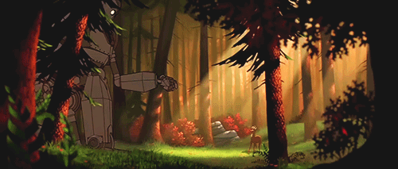

<h2 align="center">👋 Hi there! I'am Paulo Victor</h1>

<!--START_SECTION:GIF-->
<!-- 
 -->

  
   

-----

- 😄 My nickname: **PeVe**
- 🌱 I’m currently learning: **HTML, CSS, JavaScript, React and React Native**
- 🤖 Experience with robots: **Kuka, Universal Robots, Omron**
- 💬 Program skills: **C, Python, C++**
- 💾 Softwares : **PSIM, LaTeX, Git, Autodesk Eagle, Octave , Blender, ROS, Matlab, Onshape, Ultimaker Cura**
- ⚙ Embedded systems: **Raspberry Pi, Arduino, TivaWare, Esp32**
- 💻 Operational systems: **Linux, Windows**

---

<!--START_SECTION:activity-->
### Profile: 

<a href="https://github.com/paulovictor237">

  
-----

<!--START_SECTION:skills
### Languages and Tools: 

<code></code>
<code></code>
<code></code>
<code></code>
<code></code>
<code></code>
<code></code>
<code></code>
<code></code>
<code></code>
<code></code>
  
-----
-->

<!--START_SECTION:contact-->
### Contact:

Click Here 👈 

<h1 align="left">¯\_(ツ)_/¯</h1>

  
-----

