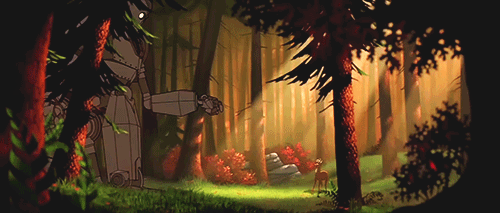
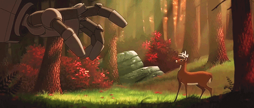

<!-- HEADER ------------------------------------------------------------------>

<h3 align="center">
  
</h3>

  
  
  
  

  
  

<!-- ABOUT ------------------------------------------------------------------->

<h2>🧑‍💻 &nbsp;About Me</h2>

<table>
  <tr>
    <td valign="top" width="50%">

- 😄 &nbsp;Nickname: **PeVe**
- 🎓 &nbsp;Mechatronic Engineer — **UFSC**
- 💼 &nbsp;Working as a **Software Developer**
- 🌎 &nbsp;Based in **Brazil**

</td>
    <td valign="top" width="50%">

- 🌱 &nbsp;Currently learning: **SQL**
- 🤖 &nbsp;Robotics: Kuka, UR Robots, Omron
- ⚙️ &nbsp;Embedded: Raspberry Pi, Arduino, Tiva, ESP32
- 💬 &nbsp;Languages: Portuguese, English

</td>
  </tr>
</table>

<!-- TECH STACK -------------------------------------------------------------->

<h2>🛠️ &nbsp;Tech Stack</h2>

<table>
  <tr>
    <td><b>Languages</b></td>
    <td></td>
  </tr>
  <tr>
    <td><b>Frontend</b></td>
    <td></td>
  </tr>
  <tr>
    <td><b>Backend &amp; DB</b></td>
    <td></td>
  </tr>
  <tr>
    <td><b>Robotics &amp; Tools</b></td>
    <td></td>
  </tr>
</table>

<!-- PROJECTS ---------------------------------------------------------------->

<h2>🚀 &nbsp;Featured Projects</h2>

| Project | Description | Stack |
|---------|-------------|:-----:|
| [**chrome-column-bookmarks**](https://github.com/paulovictor237/chrome-column-bookmarks) | Chrome extension replacing the new tab with a column-view bookmark dashboard | `TypeScript` |
| [**linux-scripts**](https://github.com/paulovictor237/linux-scripts) | Shell scripts to configure and customize an Ubuntu dev environment | `Shell` |
| [**ArmAgeddon**](https://github.com/paulovictor237/ArmAgeddon) | Undergraduate thesis — anthropomorphic robot simulation with ROS + MoveIt | `C++` |
| [**pink-candy-theme**](https://github.com/paulovictor237/pink-candy-theme) | Pink Candy dark theme port for the Zed editor | `Zed` |

<!-- STATS ------------------------------------------------------------------->

<h2>📊 &nbsp;GitHub Stats</h2>

  
  

  

  

  
<b>📈 &nbsp;More stats</b>

   
  

    
    
  

