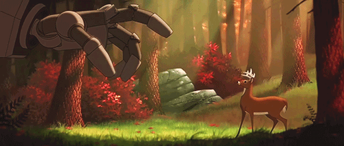

<h2 align="center">👋 Hi there! I'am Paulo Victor</h1>

<!--START_SECTION:GIF-->
<!-- 
 -->

  
   

---

- 😄 My nickname: PeVe
- 🌱 I’m currently learning: Node
- 🤖 Experience with robots: Kuka, UR Robots, Omron
- 💬 Program skills: C, C++, Python, Javascript, Typescript, React, HTML CSS
- 💾 Softwares : Gitflow, ROS, MoveIt, Octave, Matlab
- ⚙ Embedded systems: RBP, Arduino, Tiva, Esp32
- 💻 Operational systems: Linux, Windows

---

<!--START_SECTION:activity-->

### Profile:

<a href="https://github.com/paulovictor237">

---
